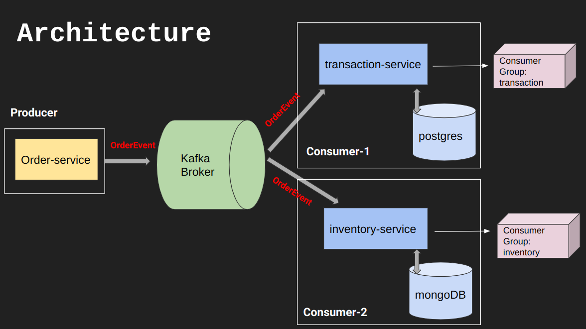

# Kafka Code

## Clone repo

        apt install git
        git clone https://github.com/suyash-srivastava-dev/testrepo.git

---

## Install Java & Kafka

        ./java_install.sh
        ./kafka_install.sh

---
## Start Zookeeper & Kafka Servers

        bin/zookeeper-server-start.sh config/zookeeper.properties
        bin/kafka-server-start.sh config/server.properties
---

## Create Topic

        bin/kafka-topics.sh --create --topic quickstart-events --bootstrap-server localhost:9092

        bin/kafka-topics.sh --describe --topic quickstart-events --bootstrap-server localhost:9092

## Write Events into Topic

        bin/kafka-console-producer.sh --topic quickstart-events --bootstrap-server localhost:9092

## Read Event 

        bin/kafka-console-consumer.sh --topic quickstart-events --from-beginning --bootstrap-server localhost:9092

---

# Project KafkaBoot





# Docker

Docker is a containerization platform that allows developers to package applications and their dependencies into portable containers that can run on any system with Docker installed. These containers provide a lightweight and efficient way to deploy and run applications, as they include all the necessary software and libraries required to run the application, but without the overhead of a full operating system.

Have used docker images of :
```s
(base) ubuntu@suyash-Ubuntu:~/Desktop$ docker images
REPOSITORY               TAG       IMAGE ID       CREATED         SIZE
mongo                    latest    9a5e0d0cf6de   3 weeks ago     646MB
postgres                 latest    b2261d3c6ce0   9 months ago    376MB
dpage/pgadmin4           latest    2d7539c5a133   10 months ago   342MB
wurstmeister/kafka       latest    a692873757c0   10 months ago   468MB
mongo-express            latest    2d2fb2cabc8f   17 months ago   136MB
wurstmeister/zookeeper   latest    3f43f72cb283   4 years ago     510MB
```

